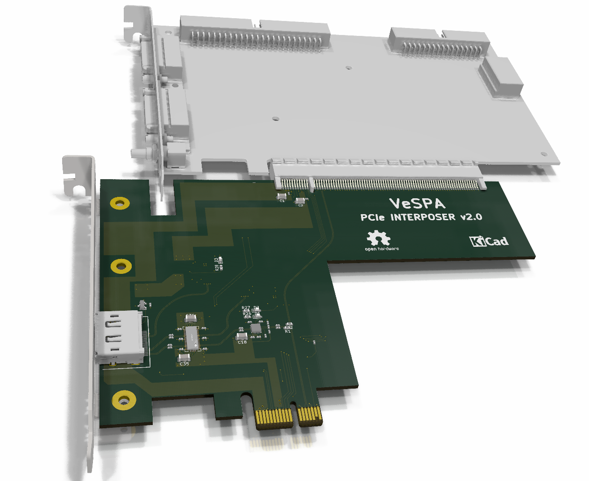

# PCIe interposer

Board design files of the VeSPA PCIe interposer

	Note: This design was performed in KiCad nightly , you will need a Nightly build to open and edit these source files.

# Status

This version has not been fully tested yet.

# What it is

This board can tap PCIe signals (RX, TX and clock) at Gen2 speed.
Signals go to a redriver before they are sent to the actual analyzer using a DisplayPort cable.
